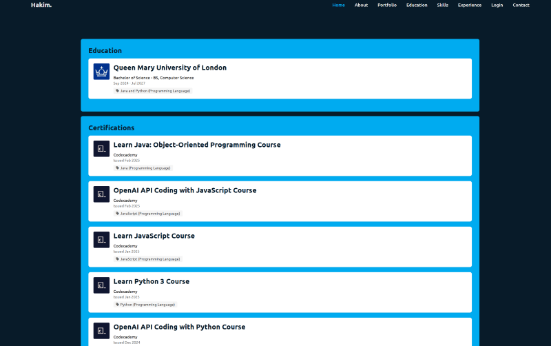
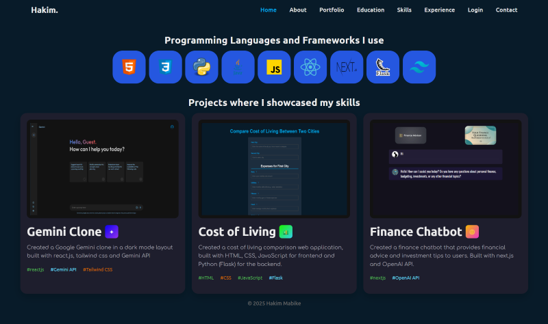
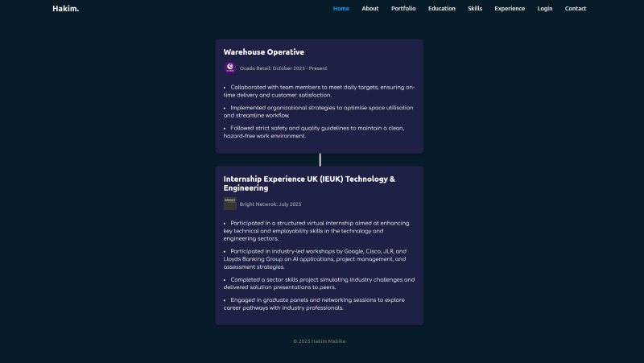
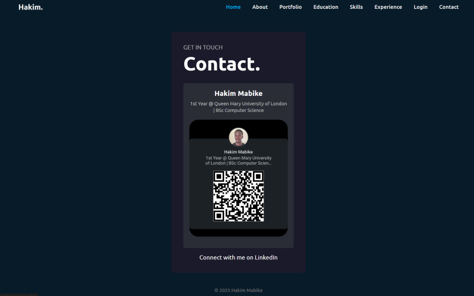
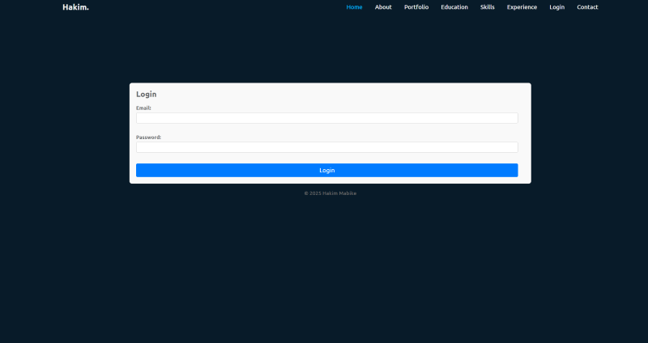
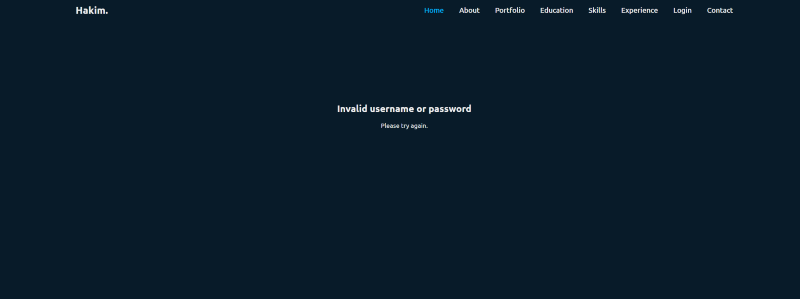
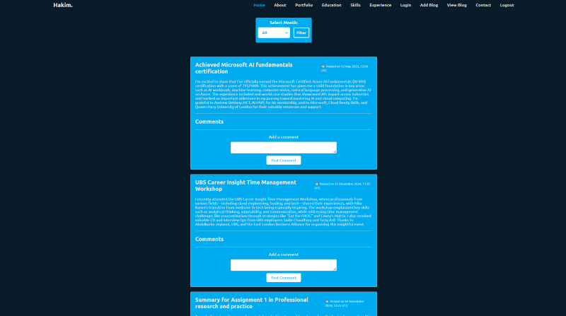
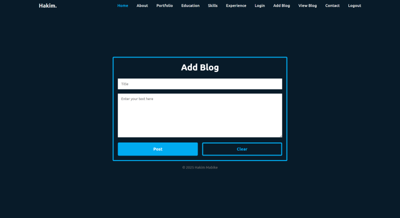
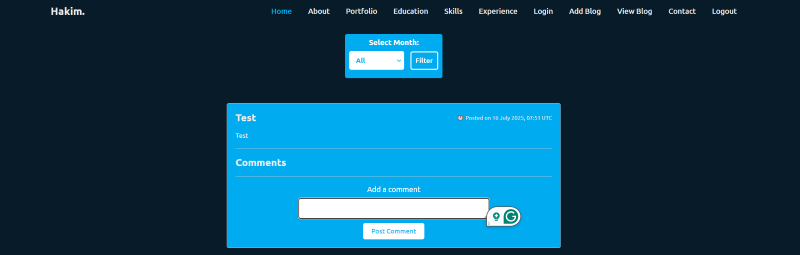
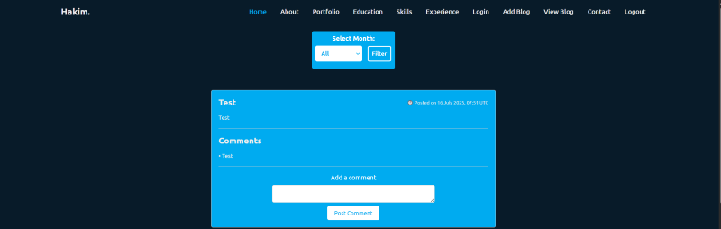

# Portfolio Project 📈

## Description 📝
This portfolio project showcases my skills and expertise as a web developer. The project demonstrates the seamless integration of front-end and back-end technologies, including HTML, CSS, JavaScript, and PHP. It is designed to provide visitors with an engaging and professional overview of my work, skills, and experiences.

The project is fully responsive, ensuring a great user experience across devices, and includes features like interactive elements, dynamic content loading, and server-side processing.

---

## Features ✨
- **Responsive Design** 🎨: Ensures optimal display on various screen sizes (mobile, tablet, desktop).
- **Dynamic Content** 📢: Utilises JavaScript to load content dynamically, enhancing user engagement.
- **Contact Form** 📮: A functional contact form built with HTML and processed using PHP.
- **Portfolio Gallery** 🌐: An image gallery showcasing projects and JavaScript interactivity.
- **PHP Integration** 🛠️: Handles form submissions and other server-side functionalities securely.
- **Custom Styling** 🎨: Unique and modern design achieved with CSS3.

---

## Technologies Used 🛠
- **HTML5**: For structuring the content of the portfolio.
- **CSS3**: For styling and responsive design.
- **JavaScript**: For interactivity and dynamic content loading.
- **PHP**: For server-side scripting and processing form submissions.

---
## Usage Guidelines 📽️
This video [Portfolio Website Recording](https://www.loom.com/share/70ba7c6efc71422db81efdb5fb23d4e4?sid=437cfa9c-49ea-4b13-8810-2a376d6afb59) will show you how to navigate through the website.

## Set up
1. For correct displaying of PHP files and database:
   - **XAMPP** for Windows  
   - **MAMP** for Mac

2. Use one of these to open the portfolio site:
   - Microsoft Edge  
   - Chrome  
   - Firefox  
   - Safari

---

## Installation 📦
Follow these steps to set up the project locally:

1. Clone the repository:
   ```bash
   git clone https://github.com/HakimM16/Portfolio-website-for-course.git
   ```

2. Download the zip file from the repository
3. Download size: approx. 40MB
4. Go to the Downloads folder and extract the file to C:\xampp\htdocs
5. Open Xampp/MAMP Control Panel and start the Apache and SQL servers


6. Start a local server. You can use tools like XAMPP, WAMP, or any PHP server of your choice.

7. Place the project files in your server's root directory (e.g., `htdocs` for XAMPP).

9. Open a browser and navigate to:
   ```
   http://localhost/phase2/index.php
   ```

---

## Usage 🔄
- Explore the homepage to view a brief introduction and navigation links.
- Check out the portfolio section to see showcased projects.
- Use the contact form to send messages or inquiries.

---

## Home Page 🏠

\
The homepage has a clean, modern design using a dark blue background and blue accents. At the top, a navigation bar includes links like Home, About, Portfolio, and Contact. The center of the page features a welcome message and two call-to-action buttons: “My portfolio” and “Contact me.” The layout is simple, professional, and easy to navigate.


## About Page 📄
\
This About page showcases me as an aspiring software engineer and Computer Science student at Queen Mary University of London. It highlights his skills in Python, JavaScript, and Java, along with his interests in cloud computing and problem-solving. The page features a profile picture, links to his GitHub and LinkedIn, and a resume download button. Navigation adapts based on user login status using embedded PHP.


## Portfolio Page 🥣
\
The portfolio page features my recent projects displayed in individual cards, including a cost of living comparator, Connect 4 game, crypto tracker, Gemini clone, and finance chatbot. Built with HTML, CSS, JavaScript, React, Flask, and Next.js, the clean and responsive layout uses flexbox for consistent spacing and alignment across devices.


## Education Page 🏫
\
This page shows my education and certificates in card form, in a single column layout.

## Skills 🔪
\
This page displays the coding langauges and frameworks I know and hgihlights the ones that I used in the projects below.

## Experience 🏢
\
This page displays all of my experiences as a student so far, presented in card format.

## Contact 📞
\
This page shows the link to my Linkedin account, where you can connect with me and view further information about me

## Login 🔐
\
This is the login page where you can enter your credentials to access the blog.

\
If the user enters the wrong information, they are presented with an invalid login page and redirected back to the login form.

## Blog 📜
\
Welcome to the blog page, where you can find all the blogs that have been created and displayed here, sorted by months. The blog uses information from the database on phpMyAdmin to fill the blog with data. This functionality relies on the use of Xampp. 

\
This is the page where you can create a blog by inputting the title and content. 

When you hit submit, your post goes live on the blog and gets saved to the database. The system automatically tracks when each post was made, so you can see the timeline on the blog. There's also a handy filter that lets you browse posts by month - it pulls the date information and sorts everything using PHP.

\
Users can add comments to blog posts. When submitted, comments are stored in the database and dynamically retrieved for display on the corresponding post.



## Contact 📞
If you have any questions or suggestions, feel free to reach out:
- Email: hakimmabike@gmail.com
- LinkedIn: https://www.linkedin.com/in/hakim-mabike-643848214
- GitHub: https://github.com/HakimM16
